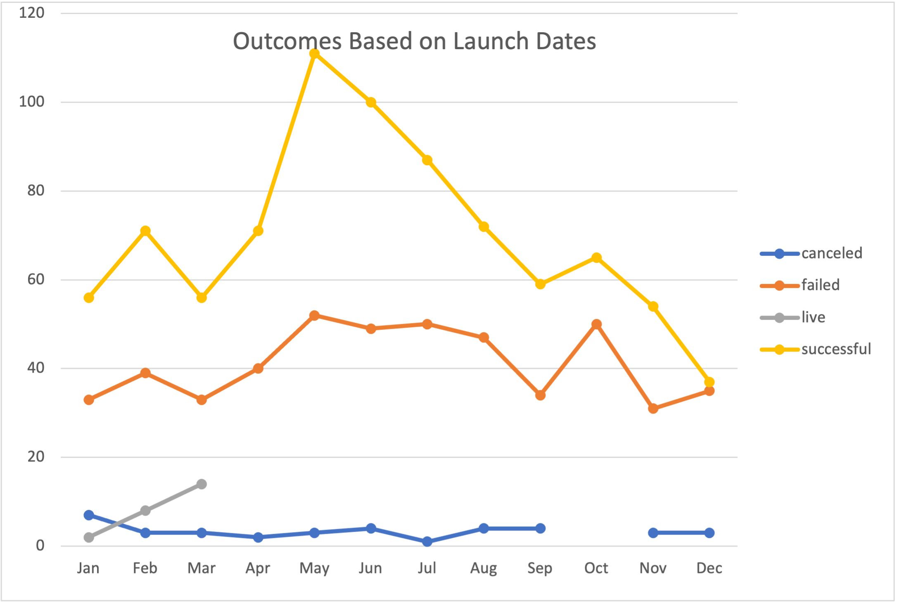
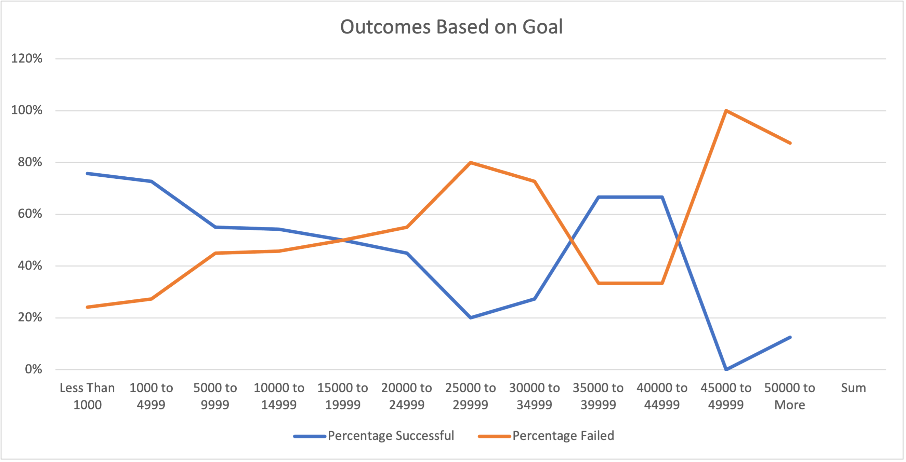

# Module-1-KickStarter
Perfom analysis on Kickstart data to uncover trends

## Overview of Project and Purpose
The purpose of this project is to analyze data work for louie's play Fever came close. Data to anzlize is different campaigns fared in relation to their launch dates. Then visualize campaign outcomes based on their launch dates and their funding goals. 

## Analysis and Challenges
With the knoweledge of pivot tables and charting to visualize campaigns on outcomes based on launch dates and their funding goals. The challenges were using the excel skills to visualize the percentage of successful, failed, and canceled plays based on the funding goal amount.

### Analysis of Outcomes Based on Launch Date
By analyzing the chart and the data we can see that it had the biggest success from March to June with the lowest 56 and the highest 100. But then started to take dive after June.

### Analysis of Outcomes Based on Goals
When looking at outcomes on goals. Majority percentage of successful less than 1000, 1000-4999 and 35000-44999.

### Challenges and Difficulties Encountered
Challenges and Difficuties I encoutnered is figuring out how to write the formula for countif() for number of successful and number of failed. Considering that their is line of goals you need to input into the formula. 
